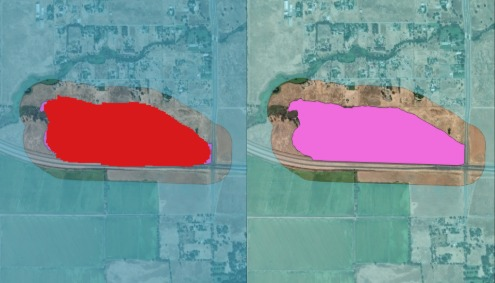
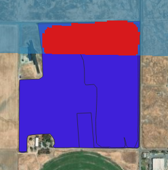

# Fine-tuning OlmoEarth for Burned Area Detection - A Tutorial

| # | Section |
| - | - |
| 0 | [Goal](#0-goal) |
| 1 | [Environment Setup](#1-environment-setup) |
| 2 | [Prepare the Dataset](#2-prepare-the-dataset) |
| 3 | [Define the Training Configuration](#3-define-the-training-configuration) |
| 4 | [Launch Fine-Tuning](#4-launch-fine-tuning) |
| 5 | [Run Inference With Your Fine-Tuned Model](#5-run-inference-with-your-fine-tuned-model) |


## 0. Goal
Let's build a burned area detection model using OlmoEarth. We will fine-tune the base model on a burned area mapping task and use it to detect fire perimeters for previously unseen fires.


## 1. Environment Setup
We recommend installing using `uv`. See [Installing uv](https://docs.astral.sh/uv/getting-started/installation/) for instructions. Once uv is installed, run:
```shell
git clone https://github.com/allenai/olmoearth_projects.git
cd olmoearth_projects
uv sync
source .venv/bin/activate
```

## 2. Preparing the Dataset
Let's start by using fire perimeter data from CalFire. These come as polygons associated with a contained date, which we will use to determine when our satellite snapshots should be captured (within 4 weeks of the contained date).

### 2a. Data Download, Filtering, and Label Creation
The following script downloads the data from CalFire and prepares it for training. It specifically:
- Downloads the data from CalFire ([data viewer](https://experience.arcgis.com/experience/b72eede32897423683a94c61bf9d3027))
- Filters out fires that happened before 2020 and creates a "label" column (label value = 'burnt' for fire polygons)
- Creates negative polygons (label value = 'unburnt') by drawing ring polygons around each fire perimeter, with a 150m gap to account for uncertainty
- Projects all polygons to EPSG:4326

<p align="center">
  
  <br>
  <em>Figure 1: Example of 'burnt' and 'unburnt' ring polygons</em>
</p>

First, set `SRC_DATA_DIR` to the directory where you want to store the downloaded CalFire dataset.
```shell
export SRC_DATA_DIR=/path/to/your/data  # Replace with your desired data directory
python3 ./docs/tutorials/FinetuneOlmoEarthSegmentation/adhoc_scripts/Calfire_data_prep.py --data-dir $SRC_DATA_DIR --gap-width 150
```

### 2b. Window Geometry Design

To prepare the dataset for fine-tuning, we need to create spatiotemporal windows. A *window* roughly corresponds to a training or validation/test example. It defines a geographic area coupled with a time range over which we want the model to make predictions.

In our case, each window should be large enough to encompass its corresponding polygon, with a minimum size that ensures the model can receive a consistent input size. The following script creates windows with a minimum size of 128×128 pixels around each polygon, and stores it in the *task_geom* field, which will be used to build the windows

**Note:** This step is specific to our use case, where polygons have varied shapes and sizes. If you're working with uniformly sized polygons or point data, you may prefer to use identical window sizes for all samples.
```shell
python3 ./docs/tutorials/FinetuneOlmoEarthSegmentation/adhoc_scripts/Calfire_taskgeom_creation.py $SRC_DATA_DIR/Calfp_2020-2025.gdb --min_box_size_pix 128
```

<p align="center">
  
  <br>
  <em>Figure 2: Example of 'burnt' and 'unburnt' windows</em>
</p>

### 2c. Creating the Standardized Annotation Files
The `olmoearth_run` tool can fully automate the dataset ingestion and preparation pipeline, provided it receives standardized GeoJSON annotation files. The following script takes our polygon and window geometries (from the output file `Calfp_2020-2025_bbox.gdb` created in step 2b) and converts them into the GeoJSON format expected by `olmoearth_run`.

We specify the window/task geometry column created in step 2b using the `--taskgeom-col` parameter. This annotation creation step can be reused for most input GIS files and enforces the standardized format expected by `olmoearth_run`.

First, set `PROJECT_PATH` to the directory where you want to store the project configuration files.
```shell
export PROJECT_PATH=./docs/tutorials/FinetuneOlmoEarthSegmentation/config
python ./scripts/oer_annotation_creation.py $SRC_DATA_DIR/Calfp_2020-2025_bbox.gdb --outdir $PROJECT_PATH --id-col polygon_id --taskgeom-col task_geom
```

### 2d. Building windows
Now that our window and polygon geometries are ready for `olmoearth_run`, we need to specify how it should interpret them and build the associated dataset windows. This is configured in the `olmoearth_run.yaml` config file located [here](./FinetuneOlmoEarthSegmentation/config/olmoearth_run.yaml).

For example, here's our window preparation configuration. The `PolygonToRasterWindowPreparer` class rasterizes our 'burnt' and 'unburnt' polygons onto the window/task footprints defined in step 2b. Since we want to fully leverage the resolution of Sentinel-2 data, we specify the `window_resolution` as 10m. Additionally, we configure a spatial split for our train/validation/test sets using a grid size of 1000 pixels (10km).

```yaml
window_prep:
  labeled_window_preparer:
    class_path: olmoearth_run.runner.tools.labeled_window_preparers.polygon_to_raster_window_preparer.PolygonToRasterWindowPreparer
    init_args:
      window_resolution: 10.0

  data_splitter:
    class_path: olmoearth_run.runner.tools.data_splitters.spatial_data_splitter.SpatialDataSplitter
    init_args:
      train_prop: 0.7
      val_prop: 0.15
      test_prop: 0.15
      grid_size: 1000
  label_layer: "label"
  label_property: "category"
  group_name: "spatial_split_10km"
  split_property: "split"
```


Now let's use `olmoearth_run` to build these windows:

```shell
export OER_DATASET_PATH=/path/to/your/oerun_dataset/folder # Replace with desired dataset folder path
python -m olmoearth_projects.main olmoearth_run prepare_labeled_windows --project_path $PROJECT_PATH --scratch_path $OER_DATASET_PATH
```

### 2e. Remote Sensing Data
At this point, we need to create a `dataset.json` file that defines our dataset schema: which layers exist, their type (raster/vector), formats, and optionally how to auto-populate them via a `data_source`. This dataset.json file should live in our project path.

In our case, we have created our windows and label layer in raster format, so we need to reflect this in the configuration. Additionally, we specify the remote sensing data we want to add to our dataset as a covariate: Sentinel-2.

```json
{
    "layers": {
        "label": {
            "type": "raster",
            "band_sets": [
                {
                "bands": ["label"],
                "dtype": "uint8"
                }
            ]
        },
        "sentinel2_l2a": {
            "type": "raster",
            "band_sets": [
                {
                "bands": [
                    "B02",
                    "B03",
                    "B04",
                    "B08"
                ],
                "dtype": "uint16"
                },
                {
                "bands": [
                    "B05",
                    "B06",
                    "B07",
                    "B8A",
                    "B11",
                    "B12"
                ],
                "dtype": "uint16",
                "zoom_offset": -1
                },
                {
                "bands": [
                    "B01",
                    "B09"
                ],
                "dtype": "uint16",
                "zoom_offset": -2
                }
            ],
            "data_source": {
                "cache_dir": "cache/planetary_computer",
                "duration": "45d",
                "harmonize": true,
                "ingest": false,
                "query": { "eo:cloud_cover": { "lt": 50 }},
                "name": "rslearn.data_sources.planetary_computer.Sentinel2",
                "sort_by": "eo:cloud_cover"
            }

        }
    }
}
```

You can find more information about how to set up your `dataset.json` config file [here](https://github.com/allenai/rslearn/blob/master/docs/DatasetConfig.md).


Now let's launch the Sentinel-2 data fetching and stitching process to match our windows:

```shell
python -m olmoearth_projects.main olmoearth_run build_dataset_from_windows --project_path $PROJECT_PATH --scratch_path $OER_DATASET_PATH
```


## 3. Define the Training Configuration

Four flavors of OlmoEarth are available on Hugging Face [here](https://huggingface.co/collections/allenai/olmoearth).

Depending on the complexity of your task, your fine-tuning budget, and your GPU memory, you can select from different encoder model sizes:


  - **OlmoEarth nano:** model_id: `OLMOEARTH_V1_NANO` | Num parameters: 1.4M
  - **OlmoEarth tiny:** model_id: `OLMOEARTH_V1_TINY` | Num parameters: 6.2M
  - **OlmoEarth base:** model_id: `OLMOEARTH_V1_BASE` | Num parameters: ~90M
  - **OlmoEarth large:** model_id: `OLMOEARTH_V1_LARGE` | Num parameters: ~300M

Now we need to design our model architecture, training loop, and evaluation metrics, and define how the data should be pre-processed and sent to the model. Behind the scenes, we use Lightning to coordinate and run the fine-tuning job. This allows us to configure every aspect of the job in a single configuration file.

You can find the full `model.yaml` file [here](./FinetuneOlmoEarthSegmentation/config/model.yaml):

Here are a few noteworthy extracts.

Our model uses the `OLMOEARTH_V1_BASE` encoder and decodes the embedded tokens with a UNet architecture, so that each input pixel is predicted by the model.

```yaml
model:
  class_path: rslearn.train.lightning_module.RslearnLightningModule
  init_args:
    model:
      class_path: rslearn.models.multitask.MultiTaskModel
      init_args:
        encoder:
          - class_path: rslearn.models.olmoearth_pretrain.model.OlmoEarth
            init_args:
                model_id: "OLMOEARTH_V1_BASE"  # Replace with your selected model
                patch_size: 4
        decoders:
          burnscar_segmentation:
          - class_path: rslearn.models.unet.UNetDecoder
            init_args:
              in_channels:
                - [4, 768]
              out_channels: 2
              conv_layers_per_resolution: 2
              kernel_size: 3
              num_channels:
                '1': 128
                '2': 256
                '4': 512
          - class_path: rslearn.train.tasks.segmentation.SegmentationHead
```

The data configuration specifies the Sentinel-2 normalization preprocessing (using OlmoEarth's default normalization) and defines the patch size and data splits:

```yaml
data:
  # ... (dataset path, inputs, task configuration)
  default_config:
      transforms:
        - class_path: rslearn.models.olmoearth_pretrain.norm.OlmoEarthNormalize
          init_args:
            band_names:
              sentinel2_l2a: ["B02", "B03", "B04", "B08", "B05", "B06", "B07", "B8A", "B11", "B12", "B01", "B09"]
      patch_size: 128 # Size of random crops within the input window
    train_config:
      groups: ["spatial_split_10km"]
      tags:
        split: "train"
    val_config:
      groups: ["spatial_split_10km"]
      patch_size: 128
      load_all_patches: true  # Load all patches (no random crops) for validation in sliding window fashion
      tags:
        split: "val"
```

You can find more information about how to set up the `model.yaml` config file [here](https://github.com/allenai/rslearn/blob/master/docs/ModelConfig.md).


## 4. Launching Fine-Tuning

First, let's verify how many data points we have in our different splits:
```shell
export GROUP_NAME="spatial_split_10km"  # Use the group name from your olmoearth_run.yaml
find $OER_DATASET_PATH/dataset/windows/$GROUP_NAME -maxdepth 2 -name "metadata.json" -exec cat {} \; | grep -oE "train|val|test" | sort | uniq -c | awk 'BEGIN{printf "{"} {printf "%s\"%s\": %d", (NR>1?", ":""), $2, $1} END{print "}"}'
```

Now let's fine-tune the model. Set up your environment variables and run the fine-tuning command:
```shell
export WANDB_PROJECT="oe_burn-scar-finetuning"  # Replace with your WandB project name
export WANDB_NAME="burn-scar_seg_s2_p4_c128_unet_lr1e4"  # Replace with your experiment name
export WANDB_ENTITY="your-wandb-entity"  # Replace with your WandB entity

python -m olmoearth_projects.main olmoearth_run finetune \
  --project_path $PROJECT_PATH \
  --scratch_path $OER_DATASET_PATH
```

The model should reach ~96% F1 score after 30 epochs.


## 5. Running Inference With Your Fine-Tuned Model

First let's create a `prediction_request_geometry.geojson` in our project folder to indicate our AOI (where we would like the model to make predictions). For this we use a window corresponding to a 'burnt' polygon from our test set:

```json
{
  "features": [
    {
      "geometry": {
        "coordinates": [
                  [[-121.368852,38.875384],
                    [-121.326357,38.875384],
                    [-121.326357,38.901207],
                    [-121.368852,38.901207],
                    [-121.368852,38.875384]]
                ],
        "type": "Polygon"
      },
      "properties": {
        "oe_start_time": "2020-06-23T00:00:00+00:00",
        "oe_end_time": "2020-07-23T00:00:00+00:00"
      },
      "type": "Feature"
    }
  ],
  "type": "FeatureCollection"
}

```

Let's add a few configuration lines to `olmoearth_run.yaml` to specify:
- partition_strategies:
  - partition_request_geometry: how to split the AOI into partitions
  - prepare_window_geometries: how to create windows within partitions
- postprocessing_strategies: how to merge results

```yaml
partition_strategies:
  partition_request_geometry:
    class_path: olmoearth_run.runner.tools.partitioners.grid_partitioner.GridPartitioner
    init_args:
      grid_size: 0.25 # (angle in degrees)

  prepare_window_geometries:
    class_path: olmoearth_run.runner.tools.partitioners.grid_partitioner.GridPartitioner
    init_args:
      grid_size: 1024 # (in pixels)
      output_projection:
        class_path: rslearn.utils.geometry.Projection
        init_args:
          crs: EPSG:3857
          x_resolution: 10
          y_resolution: -10
      use_utm: true

postprocessing_strategies:
  process_dataset:
    class_path: olmoearth_run.runner.tools.postprocessors.combine_geotiff.CombineGeotiff

  process_partition:
    class_path: olmoearth_run.runner.tools.postprocessors.combine_geotiff.CombineGeotiff

```

Finally, we specify how the dataloader should handle our prediction windows under the **data** section of our `model.yaml`.
By default, our prediction windows will be automatically created under the group: "group_partition_0". We set `load_all_patches: true` so that each patch (of size 128) within our window is visited in a sliding window fashion, with an overlap of 12.5% between patches (or 16 pixels our of 128).
```yaml
    predict_config:
      groups: ["group_partition_0"]
      patch_size: 128
      load_all_patches: true
      overlap_ratio: 0.125  # 16 / 128
      skip_targets: true
```

Now let's run the inference command:
```shell
unset TRAINER_DATA_PATH
unset DATASET_PATH
export CHECKPOINT_PATH=/path/to/your/best/checkpoint.ckpt  # Replace with path to your trained model, which by default should be located at ${OER_DATASET_PATH}/trainer_checkpoints/{your_desired_checkpoint}.ckpt

python -m olmoearth_projects.main olmoearth_run olmoearth_run \
  --config_path $PROJECT_PATH \
  --scratch_path $OER_DATASET_PATH \
  --checkpoint_path $CHECKPOINT_PATH
```

By default, the predicted windows are mosaiced together in the results folder.
We can now visualize our predictions:
```
qgis  ${OER_DATASET_PATH}/results/results_raster/{your_result_geotif}.tif
```

<p align="center">
  
  <br>
  <em>Figure 3: Fire perimeter prediction (left) and ground truth (right) on unseen window</em>
</p>


<p align="center">
  
  <br>
  <em>Figure 4: Model picking up controlled fire (purple) at the edge <br> of the prediction window (light blue) months after it happened</em>
</p>
